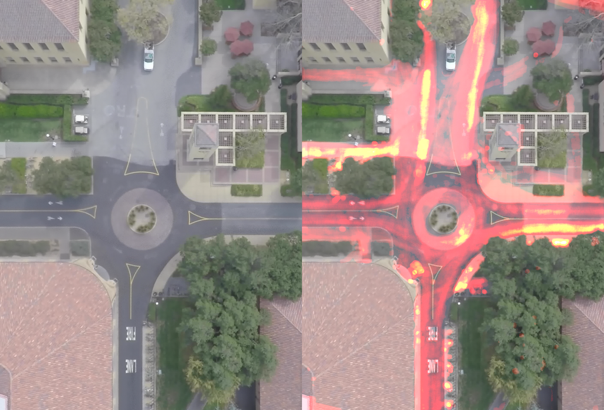
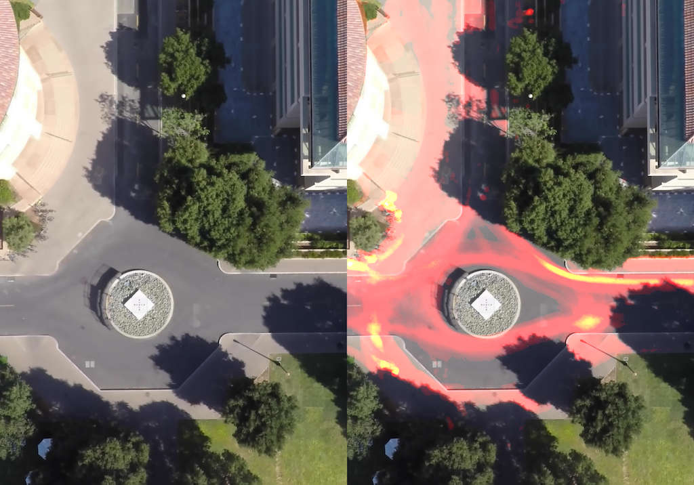
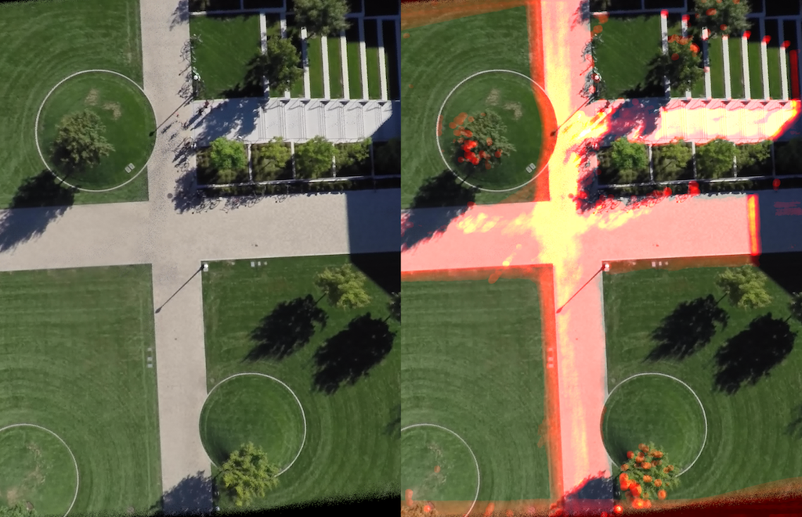
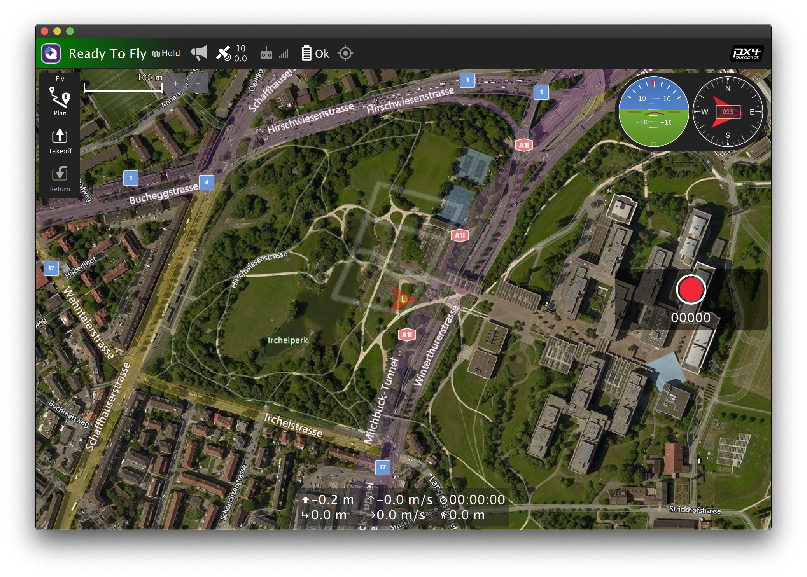
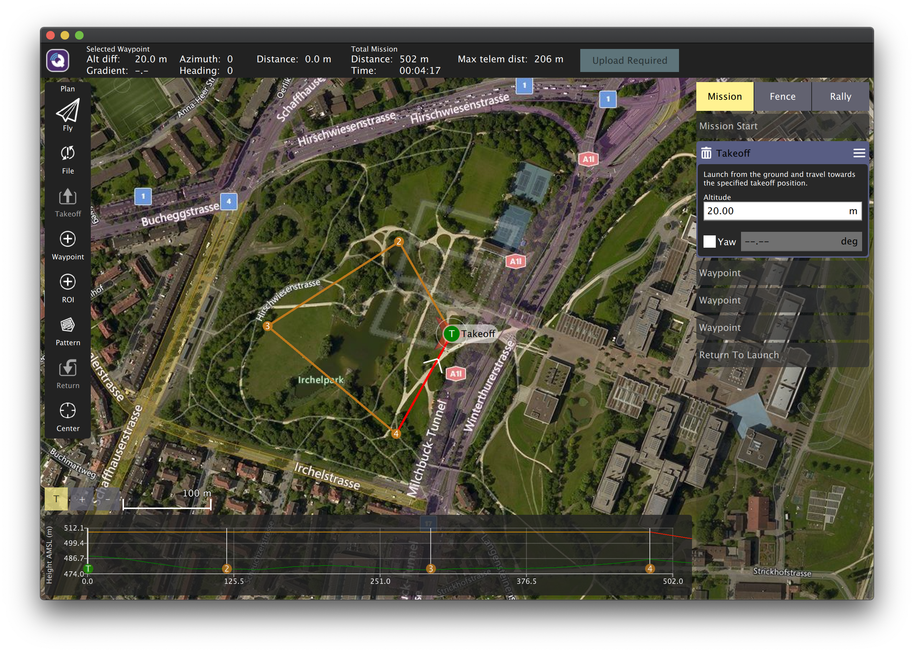
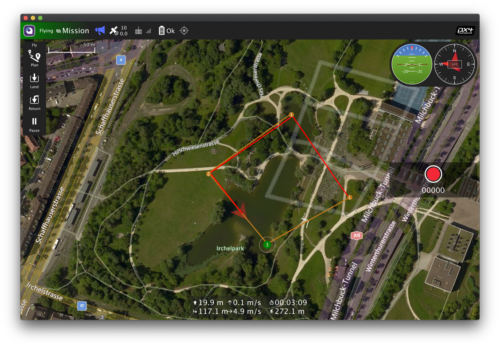

# UAV Heatmap Monitor

## Overview

This repo is intended as a submission for [NXP HoverGames Challenge 2](https://www.hackster.io/contests/hovergames2). The goal of this project is to identify pedestrian hotspots in large, public spaces so that, in the context of a pandemic, appropriate social distancing and pedestrian traffic control measures can be put in place.

And what better way to identify hotspots than... heatmaps?!? We took a few videos from the [Stanford Drone Dataset](https://cvgl.stanford.edu/projects/uav_data/), and applied heatmaps to them to illustrate what this looks like. In each image, the left side shows the averaged background (i.e. the scene with pedestrians removed), and the right side shows the generated heatmap applied onto that background.







In practice, rather than record footage and run this heatmap analysis on it afterwards, we want to be able to have a drone automatically fly to some waypoint, stay in the sky for an appropriate amount of time (i.e. long enough to be able to collect enough data), then automatically generate the heatmap. This repo contains two scripts for supporting similar workflows, both of which are intended to be run on a vehicle-based companion computer:

* `heatmap_single_point.py` - Launches a drone to a specific altitude, scans the ground and builds the heatmap, then returns the drone back down to where it was launched from.
* `heatmap_multi_point.py` - Waits for a simple waypoint-based mission plan to be uploaded to the drone (via QGroundControl), then launches the drone, generating heatmaps at each of the waypoints.

BothDetails on how to run these scripts can be found below.

## Dependencies

To run the code in this repo, you'll need the following:

* Python 3.6+
* [OpenCV-Python](https://pypi.org/project/opencv-python/)
* [MAVSDK-Python](https://github.com/mavlink/MAVSDK-Python)

To test it in a simulation environment, you'll also want:

* [Docker](https://www.docker.com)
* [QGroundControl](http://qgroundcontrol.com)

## Simulation Environment

If running either of the `heatmap_single_point.py` or `heatmap_multi_point.py` scripts on a desktop, you can simulate the drone environment using [jMAVSim](https://docs.px4.io/master/en/simulation/jmavsim.html) or [Gazebo](http://gazebosim.org). We found it simplest to run jMAVSim in headless mode (i.e. without a 3D-rendered environment) using docker:
```
docker run --rm -it jonasvautherin/px4-gazebo-headless:1.11.0
```
Once that's fired up, you can start QGroundControl -- it will automatically detect your simulated drone:

From here, you can either manually manipulate the simulated drone via QGroundControl, or you can start any of the `heatmap_*.py` scripts. Any drone manipulation that occurs in the scripts will be reflected in the simulation, and in turn QGroundControl.  


## Generating a heatmap from a drone launch point 

The `heatmap_single_point.py` script provides the ability to launch a drone straight up from its resting point, generate a heatmap based on what it sees on the ground, then return back down to its launch point. In practice, this script should be set to automatically start when the drone's companion computer boots up. It will block until it's able to connect to the drone.

Prior to running, review the configs in `config.py`, in particular those in the `SinglePointMissionConfig` as well as the `HeatmapConfig` classes. Here are some notable config options:

* `system_address` tells the script where it can connect to the drone. If running in a simulator, this will most likely be `"udp://:14540"`. If running on a companion computer that is connected to the drone via a serial port, this value will look more like `"serial:///dev/ttymxc2:50051"`.
* `render_to_screen` and `render_to_video` should both be set to `False` if running on the drone's companion computer. If testing from a desktop machine, setting them to `True` will render live output and save it to a video file.
* `video_capture_mode` determines where the input video stream is coming from. It can be set to `'FILE'`, `'CAMERA_DIRECT'`, or `'CAMERA_GSTREAMER'`. See `config.py` for more granular configs relating to each of those three options.
* `video_capture_time_seconds` specifies how many seconds the drone should hover in the air to capture data and generate a heatmap. Ideally this should be set to a larger value for sparser scenes.
* `frame_sampling_enabled` and `down_sampling_enabled` give some control over how often images should be captured from the camera, and whether or not they should be scaled down. This is useful (and recommended) when running on vehicle-based companion computers that have limited computing power and battery.

## Generating heatmaps along a drone mission path

The `heatmap_multi_point.py` provides the ability to have the drone follow a flight path that you set in QGroundControl, generating heatmaps at waypoints along the way. In practice, this script should be set to automatically start when the drone's companion computer boots up. It will block until it's able to connect to the drone.

Prior to running, review the configs in `config.py`, in particular those in the `MultiPointMissionConfig` as well as the `HeatmapConfig` classes. Refer to the previous section for a list of the most notable config options.

Once the script is invoked, it will immediately start looking for a valid mission plan:
```
2021-02-14 03:34:13,978 [INFO] Waiting for drone connection on udp://:14540
Waiting for mavsdk_server to be ready...
Connected to mavsdk_server!
2021-02-14 03:34:13,994 [INFO] Drone discovered with UUID: 0
2021-02-14 03:34:13,994 [INFO] Waiting for valid mission plan
2021-02-14 03:34:20,060 [DEBUG] Got invalid mission; waiting for a valid mission to be uploaded
2021-02-14 03:34:25,068 [DEBUG] Got invalid mission; waiting for a valid mission to be uploaded
2021-02-14 03:34:30,085 [DEBUG] Got invalid mission; waiting for a valid mission to be uploaded
...
```
This will continue until a mission plan is uploaded to the drone via QGroundControl. The Python script uses MAVSDK which doesn't support all types of mission plans, so even after a mission plan is uploaded to the drone, it may be considered invalid. In particular, Takeoff tasks are not supported, so they must be explicitly deleted from the QGroundControl plan prior to upload (see the trash can next to the Takeoff task in the screenshot below). This is certainly counter-intuitive because QGroundControl first requires you to add a Takeoff task before it allows you to add waypoints.

Once the mission plan is picked up, the script will automatically start kicking off the mission:
```
2021-02-14 03:49:54,288 [INFO] Waiting for valid mission plan
2021-02-14 03:49:54,295 [INFO] Successfully retrieved mission plan:
MissionItem: [latitude_deg: 47.3985634, longitude_deg: 8.5447721, relative_altitude_m: 20.0, speed_m_s: nan, is_fly_through: True, gimbal_pitch_deg: nan, gimbal_yaw_deg: nan, camera_action: NONE, loiter_time_s: nan, camera_photo_interval_s: 1.0]
MissionItem: [latitude_deg: 47.3979874, longitude_deg: 8.5435848, relative_altitude_m: 20.0, speed_m_s: nan, is_fly_through: True, gimbal_pitch_deg: nan, gimbal_yaw_deg: nan, camera_action: NONE, loiter_time_s: nan, camera_photo_interval_s: 1.0]
MissionItem: [latitude_deg: 47.397300699999995, longitude_deg: 8.544425, relative_altitude_m: 20.0, speed_m_s: nan, is_fly_through: True, gimbal_pitch_deg: nan, gimbal_yaw_deg: nan, camera_action: NONE, loiter_time_s: nan, camera_photo_interval_s: 1.0]
2021-02-14 03:49:54,295 [INFO] Waiting for drone to have a global position estimate
2021-02-14 03:49:54,707 [INFO] Global position estimate ok
2021-02-14 03:49:54,707 [INFO] Fetching launch point
2021-02-14 03:49:54,768 [INFO] Launch point: Position: [latitude_deg: 47.3977508, longitude_deg: 8.5456079, absolute_altitude_m: 488.2560119628906, relative_altitude_m: 0.0]
2021-02-14 03:49:54,768 [INFO] -- ARMING
2021-02-14 03:49:54,791 [INFO] -- STARTING MISSION
2021-02-14 03:49:54,823 [INFO] Heading to waypoint 1 of 3: MissionItem: [latitude_deg: 47.3985634, longitude_deg: 8.5447721, relative_altitude_m: 20.0, speed_m_s: nan, is_fly_through: True, gimbal_pitch_deg: nan, gimbal_yaw_deg: nan, camera_action: NONE, loiter_time_s: nan, camera_photo_interval_s: 1.0]
2021-02-14 03:50:34,043 [INFO] Reached waypoint 1 of 3; pausing mission to capture heatmap data
2021-02-14 03:50:34,061 [DEBUG] Waiting 2 seconds for drone to stabilize
2021-02-14 03:50:36,066 [INFO] Generating heatmap 1 of 3 at waypoint: MissionItem: [latitude_deg: 47.3985634, longitude_deg: 8.5447721, relative_altitude_m: 20.0, speed_m_s: nan, is_fly_through: True, gimbal_pitch_deg: nan, gimbal_yaw_deg: nan, camera_action: NONE, loiter_time_s: nan, camera_photo_interval_s: 1.0]
...
```
